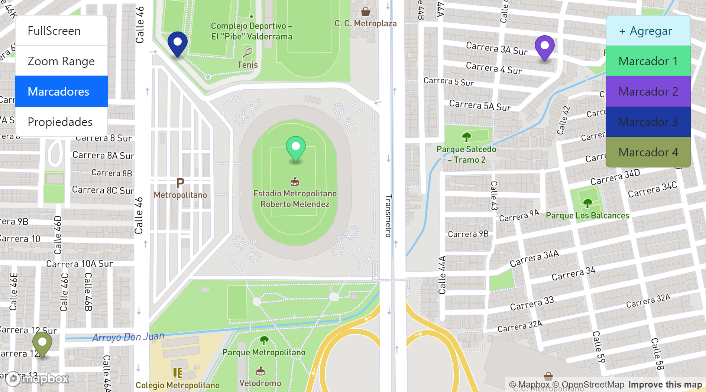

# AngularMapApp

## Descripción 📖

Aplicación en Angular para el uso de mapas interactivos con la libreria [MapBox](https://www.mapbox.com/), la aplicación permite:

- Mostrar mapas en pantalla completa.
- Manipular el zoom del mapa por medio de un range.
- Añadir, mover y eliminar marcadores.
- Uso de mini mapa reutilizables.

## Competencias adquiridas 🎨

- Uso de la libreria [MapBox](https://www.mapbox.com/)
- ViewChild para referencias de elementos HTML
- Uso de hooks del ciclo de vida como: **AfterViewInit** para manipular el DOM, cuando este listo y **OnDestroy** para la eliminación de listeners.

## Tecnologias utilizadas 🕹

- [Angular](https://angular.io/) versión 14.0.0
- [Bootstrap](https://getbootstrap.com/) versión 5.2.0
- [MapBox](https://www.mapbox.com/)
